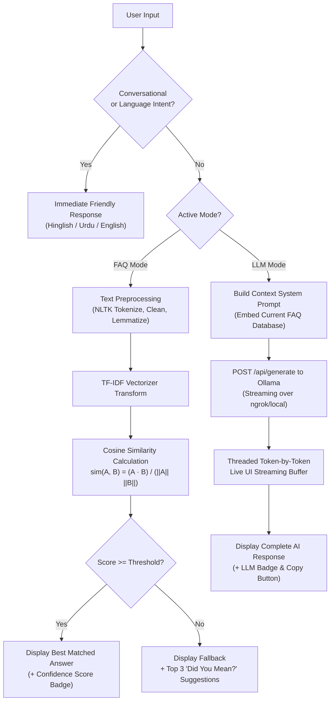

# 🤖 AI Hybrid FAQ Chatbot - Multilingual Desktop Application

[](https://www.python.org/)
[](https://customtkinter.tomschimansky.com/)
[](https://scikit-learn.org/)
[-orange.svg)](https://ollama.com/)
[](#license)

A modern, professional-grade desktop chatbot application developed in Python. It features a **Hybrid AI Architecture** combining an offline **TF-IDF + Cosine Similarity** NLP matching engine with live token-streaming from a self-hosted **Ollama Large Language Model** (e.g., `qwen2.5-coder:32b` via ngrok or local network).

The chatbot provides seamless **multilingual communication** in **Hinglish (Roman Urdu)**, **Urdu script**, and **English**, complete with full clipboard copying tools and a real-time database manager.

---

## 🌟 Key Highlights

- ⚡ **Dual-Mode AI Engine:**
  - **FAQ Mode (Offline):** Instant keyword and semantic matching using TF-IDF and Cosine Similarity. No internet connection required.
  - **LLM Mode (Online):** Connects to a self-hosted Ollama server via ngrok or local URL. Injects the active FAQ database as context and streams AI responses live token-by-token (ChatGPT-like experience).
- 🌐 **Multilingual Support:**
  - Automatically recognizes and responds in **Hinglish / Roman Urdu** (e.g., *"kya hal hai"*, *"order kaisy cancel hoga"*), **Urdu script** (e.g., *"آپ کیسے ہیں؟"*), and **English**.
  - Supports explicit language-switch requests (e.g., *"Hinglish me baat kro"*, *"speak in English"*).
  - Uses friendly, simple explanations accessible to non-technical users and students.
- 📋 **Complete Clipboard Integration:**
  - Dedicated **"📋 Copy"** button on every user question and bot response with instant *"Copied! ✓"* visual confirmation.
  - Right-click context menu (**Copy Message**) on any chat bubble.
  - Right-click context menu (**Cut / Copy / Paste / Select All**) on the input text entry box.
- 📚 **Interactive Database Manager:**
  - Split-pane layout: live search/filter on the left, full edit form on the right.
  - **Full CRUD Support:** Add new FAQs, edit existing records, or delete items.
  - Instantly retrains the vectorizer in-memory upon saving changes.
- ⚙️ **Comprehensive Settings & Diagnostics:**
  - Similarity threshold slider (0.0 to 1.0) to control match sensitivity.
  - Multi-profile dataset loader: switch between **Overall / General Assistant**, **E-commerce Support**, and **University Admissions**.
  - Import/Export datasets in JSON or CSV format.
  - Ollama Server configuration card with live **"Test Connection"** ping button.
  - Dark / Light / System theme selector.

---

## 🏗️ Architecture & NLP Pipeline



---

## 📁 Repository Structure

```text
├── data/
│   ├── general_faq.json       # Multi-topic general assistant dataset (Default)
│   ├── ecommerce_faq.json     # E-commerce customer support questions
│   └── university_faq.json    # University admissions & academic inquiries
├── faq_engine.py              # NLP preprocessing, TF-IDF, Cosine Similarity & CRUD
├── llm_engine.py              # Ollama API communication, threaded streaming & context prompt
├── gui.py                     # CustomTkinter dashboard, chat bubbles, manager & settings
├── main.py                    # Application bootstrapper, NLTK automated setup & entry point
├── verify_engine.py           # Automated test suite (6 verification test cases)
├── .gitignore                 # Python cache, virtual envs, and system file ignore rules
└── README.md                  # Comprehensive project documentation
```

---

## 🚀 Installation & Setup

### 1. Prerequisites
- Python 3.10, 3.11, 3.12, or 3.13
- Git installed on your machine

### 2. Clone the Repository
```bash
git clone https://github.com/Iqra-Mushtaq2052/FAQ-Chatbot.git
cd FAQ-Chatbot
```

### 3. Install Dependencies
```bash
pip install customtkinter scikit-learn nltk requests scipy numpy
```

### 4. Run the Application
```bash
python main.py
```
> **Note:** On first startup, `main.py` automatically downloads required NLTK corpora (`punkt`, `wordnet`, `stopwords`, `omw-1.4`) in the background so you won't encounter missing resource errors.

---

## 🤖 Using the Ollama LLM Mode (Optional)

If you have an Ollama server running (e.g., on Google Colab or locally with `qwen2.5-coder:32b`):

1. Expose Ollama with ngrok (or use `http://localhost:11434` if running locally).
2. Open the chatbot and navigate to **Settings & Info** in the sidebar.
3. In the **LLM Server Configuration** card:
   - Paste your ngrok URL (e.g., `https://your-tunnel.ngrok-free.dev`).
   - Enter your model name (e.g., `qwen2.5-coder:32b`).
4. Click **Save Config**, then click **Test Connection** (you should see green confirmation: *"Connected!"*).
5. In the sidebar at the bottom, toggle the **LLM Mode** switch to **ON**.
6. Ask any question in chat — the response will stream live from your self-hosted AI model!

---

## 🧪 Automated Verification Tests

You can run the built-in test suite to verify NLP text cleaning, conversational intents, and cosine similarity matching:

```bash
python verify_engine.py
```

### Expected Output:
```text
==================================================
[TEST] Running FAQ Engine NLP Verification Tests
==================================================
Loading test database: .../data/general_faq.json
[OK] Successfully loaded 27 FAQ records.

NLP Engine Status:
  scikit-learn available: True
  NLTK available        : True
  Engine is_trained     : True

Testing Case: [Conversational Greeting (hy / hello)]       [PASS]
Testing Case: [Technology Concept (What is AI?)]            [PASS]
Testing Case: [Account Security (Password Protection)]     [PASS]
Testing Case: [Customer Support (Contact Help Desk)]        [PASS]
Testing Case: [Services & Tracking (Order Status)]          [PASS]
Testing Case: [Out of Vocabulary (Unrelated)]               [PASS]
--------------------------------------------------
SUCCESS: ALL TEST CASES PASSED SUCCESSFULLY!
```

---

## 📄 License

This project is licensed under the MIT License - feel free to use, modify, and distribute it for academic, personal, or commercial purposes.
